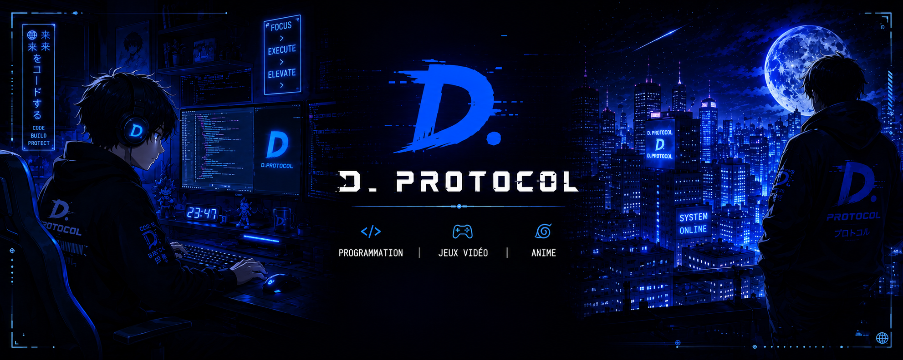

  

---

 

  

<h2 align="center">
  👋 Welcome, I'm <strong>D. Protocol</strong>
</h2>

  

  I love turning ideas into reality  
  from a simple line of code to intelligent systems, robots and creative projects.
    
  Always learning, always experimenting, always building something new.

 

  
  &nbsp;
  
  &nbsp;
  
  &nbsp;
  

---

## 🛠 &nbsp;Tech Stack

 
<table border="1" cellspacing="0" cellpadding="16">
  <tr>
    <th colspan="5">⌨️ &nbsp; Languages</th>
  </tr>
  <tr>
    <td align="center" width="110">
       
      <b>Python</b>
    </td>
    <td align="center" width="110">
       
      <b>JavaScript</b>
    </td>
    <td align="center" width="110">
       
      <b>Java</b>
    </td>
    <td align="center" width="110">
       
      <b>C</b>
    </td>
    <td align="center" width="110">
       
      <b>C#</b>
    </td>
  </tr>
</table>
 
<table border="1" cellspacing="0" cellpadding="16">
  <tr>
    <th colspan="5">🌐 &nbsp; Web & Backend</th>
  </tr>
  <tr>
    <td align="center" width="110">
       
      <b>React</b>
    </td>
    <td align="center" width="110">
       
      <b>Next.js</b>
    </td>
    <td align="center" width="110">
       
      <b>Node.js</b>
    </td>
    <td align="center" width="110">
       
      <b>FastAPI</b>
    </td>
    <td align="center" width="110">
       
      <b>Nest.js</b>
    </td>
  </tr>
</table>
 
<table border="1" cellspacing="0" cellpadding="16">
  <tr>
    <th colspan="5">🤖 &nbsp; AI · Data Science</th>
  </tr>
  <tr>
    <td align="center" width="110">
       
      <b>PyTorch</b>
    </td>
    <td align="center" width="110">
       
      <b>TensorFlow</b>
    </td>
    <td align="center" width="110">
       
      <b>Scikit-learn</b>
    </td>
    <td align="center" width="110">
       
      <b>Pandas</b>
    </td>
    <td align="center" width="110">
       
      <b>OpenAI</b>
    </td>
  </tr>
</table>
 
<table border="1" cellspacing="0" cellpadding="16">
  <tr>
    <th colspan="2">🦾 &nbsp; Robotics & Embedded</th>
  </tr>
  <tr>
    <td align="center" width="110">
       
      <b>Arduino</b>
    </td>
    <td align="center" width="110">
       
      <b>ROS 2</b>
    </td>
  </tr>
</table>
 

---

## 📊 &nbsp;GitHub Stats

 

<!--  

&nbsp;
 -->
  

 

---

 

  

